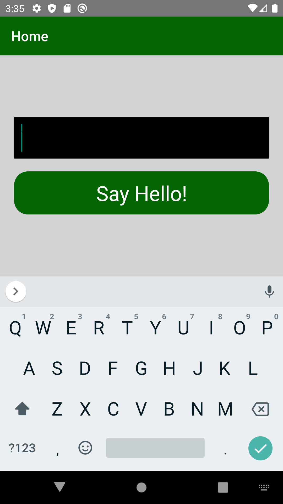
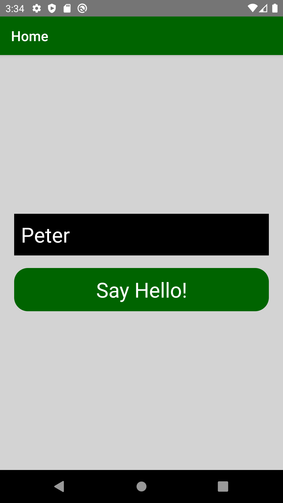

# react-native-app
Getting to learn react native


# A) How to run:
## A-1) Running the application:

In the CLI, run this code:

```bash
export NODE_OPTIONS=--openssl-legacy-provider
npm start
```

Now, go the android studio, and run the application on the emulator.

## A-2) Debugging:

Run the application with React-Native Debugger.  
To control the application in the emulator, **`ctrl + m`**


# B) Screenshots:


  
  
  


